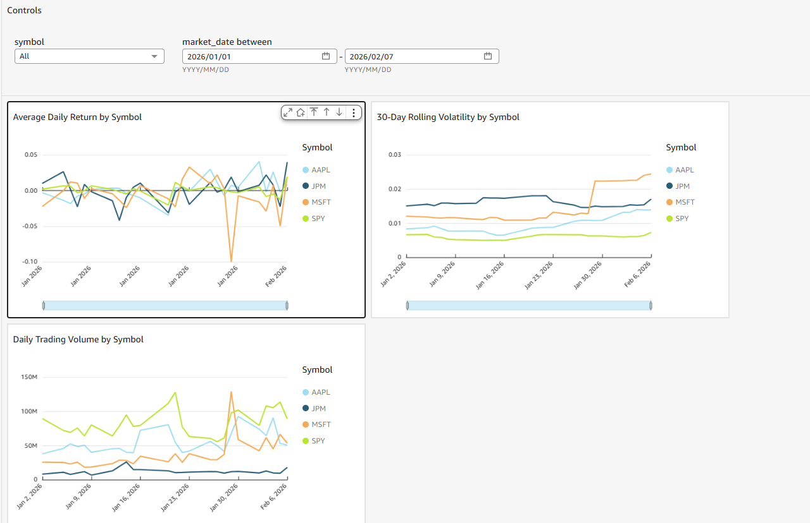
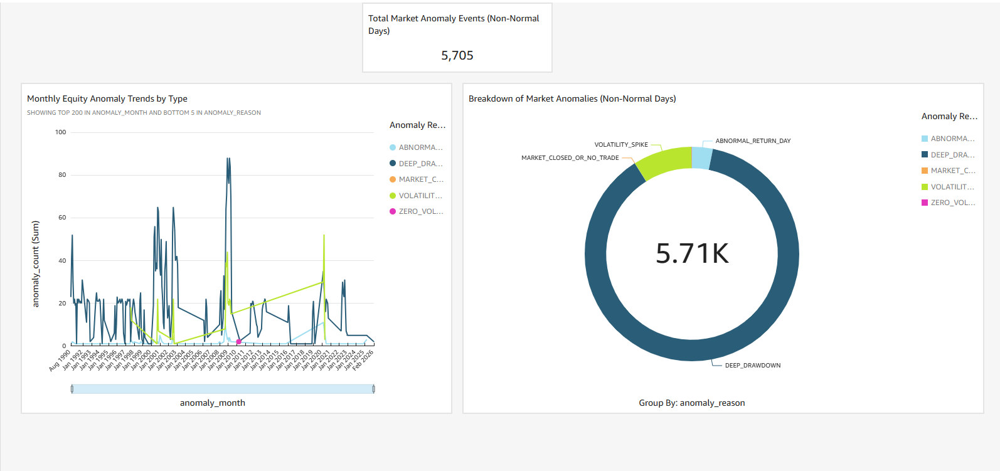
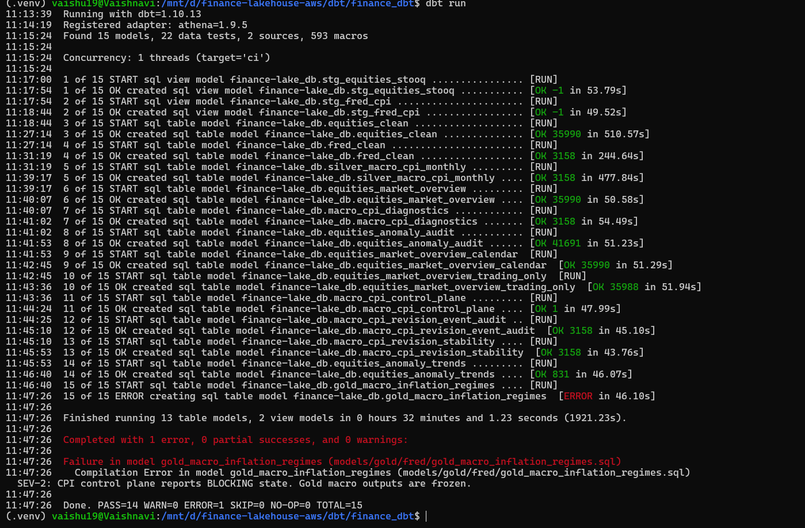

# AWS Finance Lakehouse

## Overview

The AWS Finance Lakehouse is a production-pattern, end-to-end data engineering system that models how modern financial data platforms are built, governed, and operated in practice.

**Tech Stack:** AWS S3 · Athena · Glue Data Catalog · dbt (Athena adapter) · Lambda · EventBridge · GitHub Actions · Terraform

---

## Architecture

**Cloud:** AWS  
**Core Stack:** S3 · Athena · Glue Data Catalog · dbt (Athena adapter) · Lambda · EventBridge · GitHub Actions · Terraform

### Data Flow (High Level)

- EventBridge schedules ingestion
- Lambda ingests raw financial data into S3
- dbt transforms data through staging → silver → gold
- Athena executes transformations using Glue metadata
- GitHub Actions enforces quality and promotion rules

All infrastructure is provisioned via **Terraform**.  
No manual console configuration.

---

## 🎯 Deployment 

### System Scale
- **Equity symbols tracked:** AAPL, JPM, MSFT, SPY
- **Market anomalies detected:** 5,705+ events classified
- **Data domains:** FRED macroeconomic CPI + STOOQ equities
- **Infrastructure:** Fully provisioned via Terraform, zero manual configuration

### Live Analytics Output

*Multi-symbol performance tracking: daily returns, 30-day rolling volatility, trading volume analysis*

*Anomaly classification dashboard: 5,705+ non-normal market events identified (deep drawdowns, volatility spikes, zero-volume days)*

**What this demonstrates:**
- End-to-end lakehouse: Lambda ingestion → dbt transformation → Athena queries → QuickSight dashboards
- Production-scale analytics: Real financial data processing with multi-symbol tracking
- Advanced analytics layer: Anomaly detection, volatility analysis, returns calculation

### Data Quality Gates in Action

This pipeline enforces **severity-based quality gates** that block bad data from reaching production.

*Real production example: CPI control plane detected data instability and blocked gold layer promotion*

**What happened in this run:**
- ✅ 15 dbt models executed
- ✅ 22 data quality tests ran
- ❌ SEV-2 gate triggered: "CPI control plane reports BLOCKING state"
- ⚠️ Gold macro models frozen: "Gold macro outputs are frozen"
- ✅ Previous valid data preserved: Downstream analytics unaffected

**Why this matters:**
This demonstrates **governance over availability** — the pipeline correctly failed to protect data integrity. When CPI revision data showed instability outside acceptable thresholds, the quality gate blocked promotion rather than propagating questionable data.

See [docs/data-quality.md](./docs/data-quality.md) for the full severity framework and [docs/runbook.md](./docs/runbook.md) for operational procedures.

---

## Data Domains

The lakehouse contains **two independent financial domains**, governed under the same severity framework.

### 1. FRED — Macroeconomic CPI Data

**Source:** Federal Reserve Economic Data (FRED)

Purpose:
- Track CPI time series
- Model data revisions explicitly
- Detect unstable macroeconomic conditions
- Block downstream analytics when assumptions are invalid

Characteristics:
- Revision-aware ingestion
- Control-plane driven promotion
- Gold models intentionally fail when CPI stability is violated

---

### 2. STOOQ — Equity Market Data

**Source:** STOOQ historical equities data

Purpose:
- Clean and standardize OHLCV data
- Enforce strict market-date grain
- Surface market anomalies
- Provide analytics-ready equity aggregates

Characteristics:
- Hard grain enforcement at silver
- Trading-calendar aware transformations
- Anomaly audit and trend models in gold

**Downstream Consumption:**
- Amazon QuickSight dashboards:
  - **Equities Market Overview**
  - **Market Anomaly Trends**

Dashboards consume **gold models only** and rely entirely on upstream promotion gates for trust.

---

## Lakehouse Layers

### Staging Layer

**Responsibility:** Ingestion correctness only

- Raw → typed data
- No business logic
- No assumptions of truth
- Views only (CI-safe for Athena)

---

### Silver Layer

**Responsibility:** Business truth and structural integrity

This is where **data engineering discipline lives**.

Enforced rules:
- Canonical grain per domain
- Required identifiers present
- Structural correctness

**SEV-1 violations block promotion immediately.**

Examples:
- STOOQ: duplicate `(symbol, market_date)` → hard fail
- FRED: missing identifiers or non-numeric CPI values → hard fail

Silver models contain **explicit SQL promotion gates**, not just tests.

---

### Gold Layer

**Responsibility:** Analytics-ready, decision-making data

- Aggregations and metrics
- Audit and anomaly models
- Domain-specific logic

Promotion rules:
- **SEV-2 failures block gold** (business invalid)
- **SEV-3 failures alert only** (monitoring)

Gold models are allowed to **fail by design** when upstream signals indicate unsafe conditions.

---

## Data Quality & Governance Model

This project uses a **severity-based governance framework**, modeled after real production systems.

### Severity Levels

**SEV-1 — Structural / Contract Violations**
- Grain violations
- Missing identifiers
- Schema breaks  
❌ Blocks silver

**SEV-2 — Domain / Business Invalidity**
- CPI revisions invalidate analysis
- Impossible OHLC values  
❌ Blocks gold

**SEV-3 — Anomalies / Monitoring**
- Outliers
- Zero-volume days
- Drift signals  
⚠️ Alert only

**Key principle:**  
Tests detect. Gates enforce.

---

## Control-Plane Pattern (FRED)

The FRED CPI pipeline implements a control-plane architecture:

1. `macro_cpi_diagnostics` evaluates revision stability
2. `macro_cpi_control_plane` emits ALLOW / BLOCK
3. Gold models read the control plane
4. Gold models fail intentionally when state = BLOCKING

This mirrors regulated financial systems where **fresh data is not always safe data**.

---

## CI/CD

### GitHub Actions

Every run executes:
1. dbt compile
2. dbt run
3. dbt tests
4. Promotion gate enforcement

Failures are:
- Deterministic
- Loud
- Non-recoverable without fixing root cause

No manual cleanup. No S3 wipes. No hacks.

### Athena-Safe Design

- Staging models are views
- Silver and gold are tables
- No destructive operations in CI

---

## Infrastructure as Code

All infrastructure is managed via **Terraform**:
- S3 buckets (raw / clean / gold / query)
- IAM roles and policies
- Glue databases and permissions
- Lambda ingestion
- EventBridge schedules

---

## Project Philosophy

This lakehouse demonstrates production data engineering principles:

**Governance enforced in code:**
- SEV-1 violations (structural errors) block silver layer
- SEV-2 violations (business invalidity) block gold layer
- Quality gates stop bad data, not just alert on it

**Operational maturity:**
- Full infrastructure-as-code (Terraform)
- Deterministic CI/CD (GitHub Actions)
- Documented runbooks and incident procedures

**Real production behaviors:**
- Pipelines designed to fail safely
- Analytics blocked when trust is broken
- No silent data corruption

See [docs/architecture.md](./docs/architecture.md) for design details and [docs/lessons-learned.md](./docs/lesson-learned.md) for debugging insights.

---

## Documentation

- [Architecture Overview](./docs/architecture.md) - System design and component responsibilities
- [Operational Runbook](./docs/runbook.md) - Daily operations and incident response
- [Data Quality Framework](./docs/data-quality.md) - Severity-based governance model
- [Lessons Learned](./docs/lessons-learned.md) - Real debugging scenarios and solutions

---

--

## Current Status

Infrastructure was destroyed after January 2025 to avoid ongoing AWS costs during job search. All code, documentation and architectural decisions are preserved in this repository. The full stack rebuilds using `terraform apply` followed by `dbt build` — no manual steps required.

---
